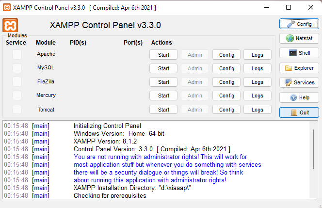
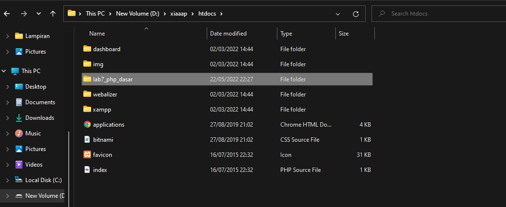
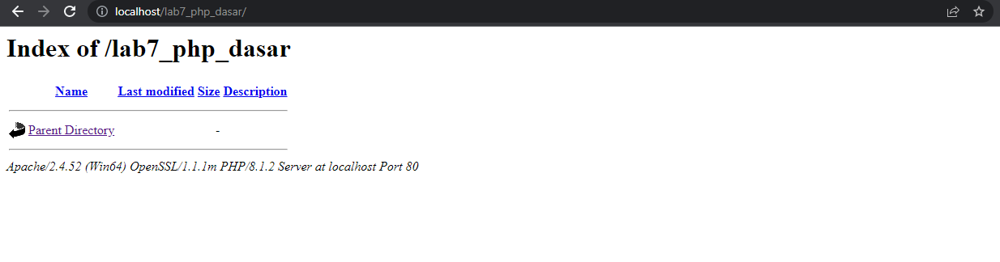

# Lab7_PHP_Dasar

**Nama : Fery Affandi**  
**NIM : 312010018**  

# Langkah-langkah praktikum 7

##  Instal Xampp

 Gambar 7.1 Xampp Control

- Uji coba apakah server sudah bekerja dengan baik
http://127.0.0.1 atau http://localhost   
Tampilan halaman utama Xampp jika server sudah bekerja dengan baik.

- Dokumen Website  
Semua file website tempatkan di direktori: <b>\xampp\htdocs\ </b>

- Database MySQL   
Direktori: <b> \xampp\mysql\ </b>

- Manajemen database: <b> http://localhost/phpmyadmin </b> 

## <b> Memulai PHP </b>

buat folder dengan nama <b>lab7_php_dasar</b> pada root directory web  server <b>(d/xiaaap/htdocs).</b> 
*(Harusnya xampp tapi dikarenakan di folder saya namanya xiaaap jadi saya tulis xiaaap)*

Gambar 7.2 Directory Lab7

Kemudian untuk mengakses direktory tersebut pada web server dengan mengakses url: http://localhost/lab7_php_dasar/ 

Gambar 7.3 Tampilan Web Server

Gambar 7.3 Tampilan Web Server

